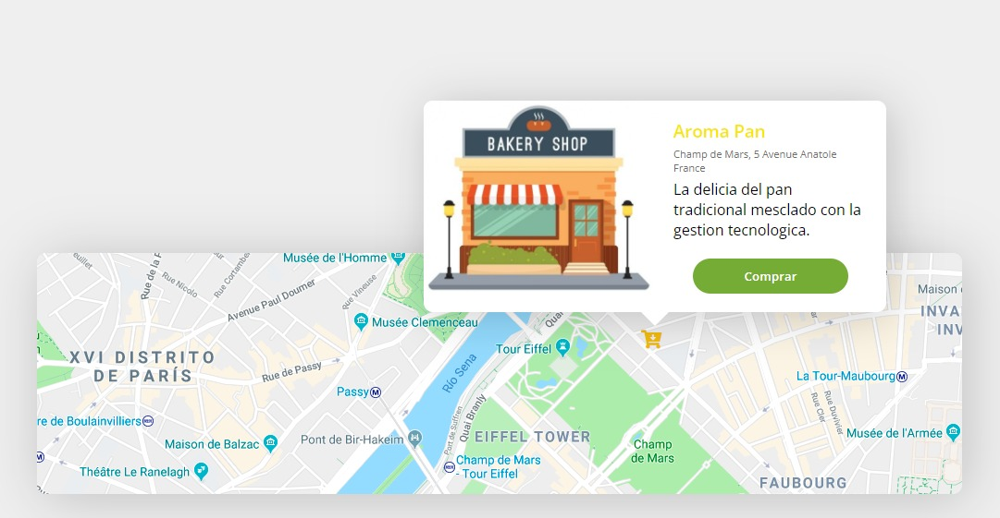

# Tooltip_JavaScript
## En este proyecto utilizamos Html5, Css3 y JavaScript
### Al pasar el mouse por la ubicación en la posicion de icono de ¨tienda¨ se despliega un tooltip que muestra información.

